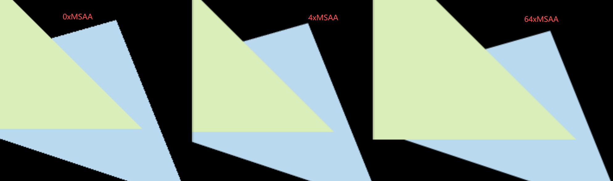

实现了自定义msaa?x(?只能为平方数)，对比不同采样点效果(？值通过r构造时的参数修改)

##### msaa0x效果：

##### msaa4x效果：

##### msaa16x效果：

##### msaa64x效果：

##### 对比效果：

看起来从0x->4x效果提升很明显。

4x->64x增加了这么多倍采样点，但是效果提升并不如预期那么明显。

（这就是大家玩cs2都开4X MSAA的原因？）

##### 注意事项：

set_msaa_pixel内的机制需要思考一下。

一开始set_msaa_pixel时，frame_buf[ind] = frame_buf[ind]*(1.0f-covered_ratio) + color *covered_ratio;

这种写法在这个场景没问题(只有两个三角形，且先画的近的三角形，再画的远的三角形，z-buffer机制直接没画远的三角形)

但是当一个采样点覆盖的三角形多了以后就会出问题。(在作业3里尝试增加msaa功能后发现)

因此除了维护一个采样点msaa_depth_buffer外，还必须再维护一个颜色值msaa_frame_buffer。必须针对每个采样点进行颜色的替换。