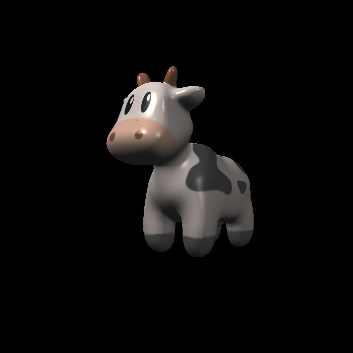
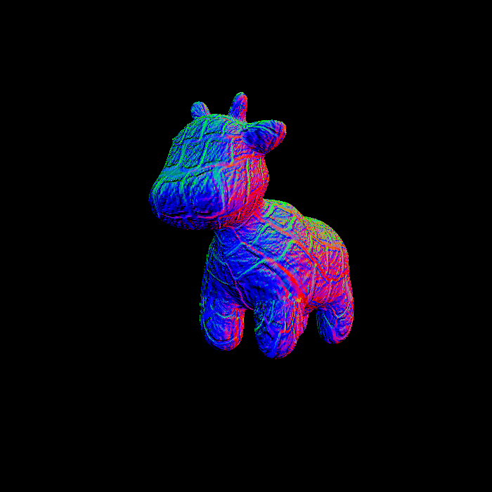
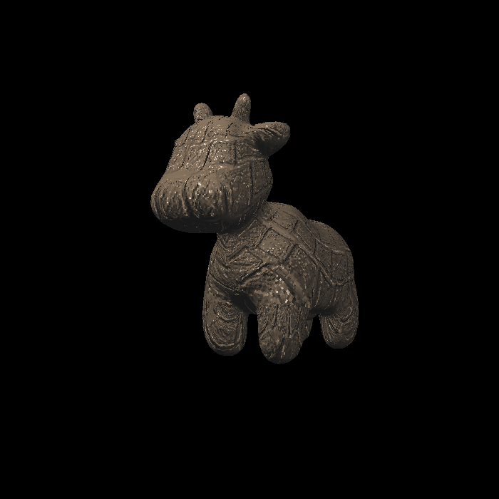
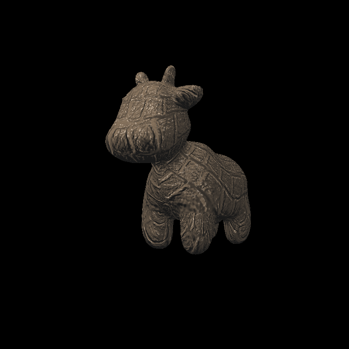
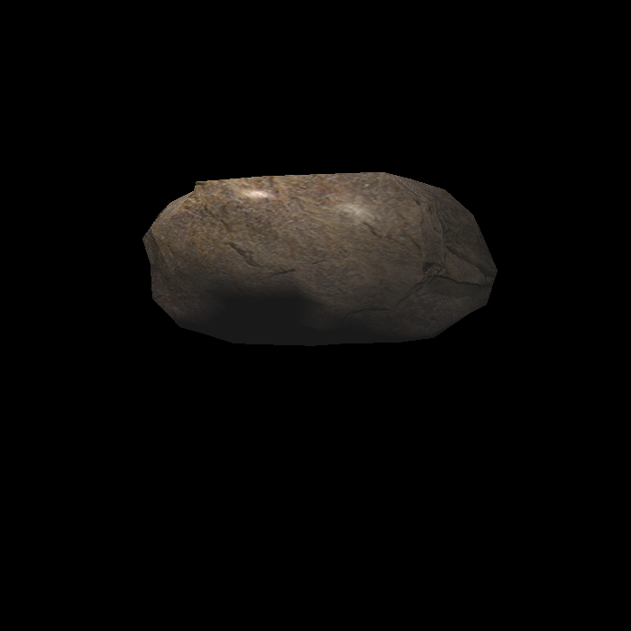
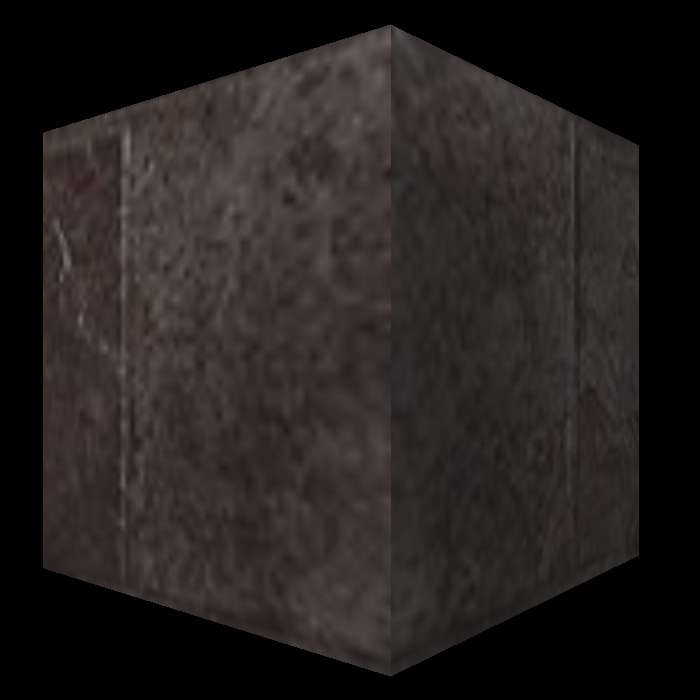
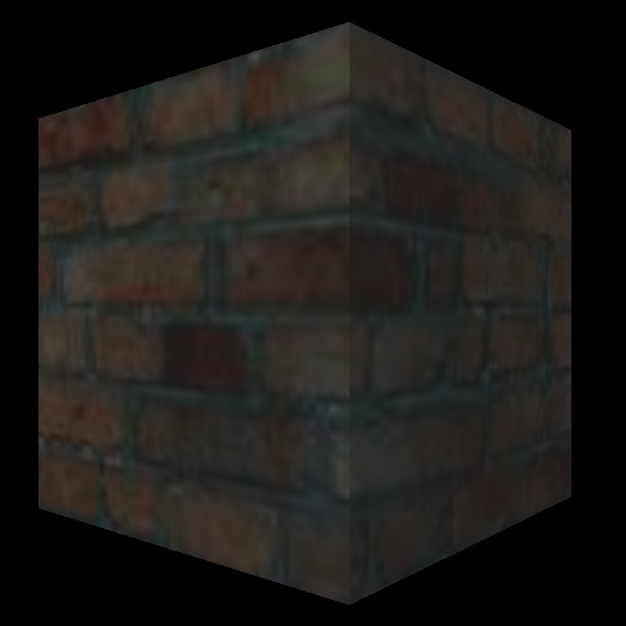
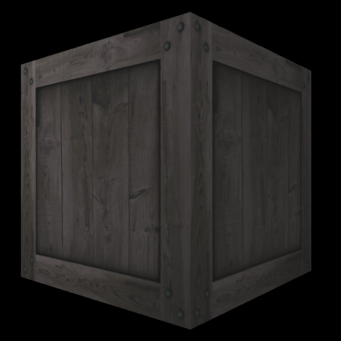

### Assigment3作业

第一个图片被其他错误生成的覆盖了，就不贴了。

#### 2.Blinn-Phone反射模型效果：


#### 3.实现纹理：


双线性插值后效果，可以发现区域边缘会更平滑：



#### 4.Bump Mapping：


PS：作业框架在构建TBN矩阵时，似乎想要强行构造了一个垂直于n的向量t。但是这里好像少了个负号：

```
// Let n = normal = (x, y, z)
// Vector t = (x*y/sqrt(x*x+z*z),sqrt(x*x+z*z),z*y/sqrt(x*x+z*z))
```

```
 t = (x*y/sqrt(x*x+z*z),-sqrt(x*x+z*z),z*y/sqrt(x*x+z*z))
```

使用增加负号的bump mapping效果(背部好像看起来会舒服一点)：

(为了与预期图片相同，除了这里都使用不加负号的t向量构造方式)



#### 5.displacement效果：



双线性插值displacement效果：



可以看到大的色块部分平滑模糊了

### 6.导入其他obj










PS: Crate自带的obj不能用，里面的face是四个顶点的四边形(实现的光栅化是针对三角形)，且没有normal法向量。

需要使用blender导入blend文件后，将四边形切割为三角形且计算法向量再导出能用的triangle obj


#### 7.融合MSAA4x效果

尝试了下把作业2的MSAA功能增加进来，对每个采样点进行对应的shader着色：


对比只有双线性插值，这张增加了MSAA效果的图片的边缘锯齿感明显减少，效果更好了。