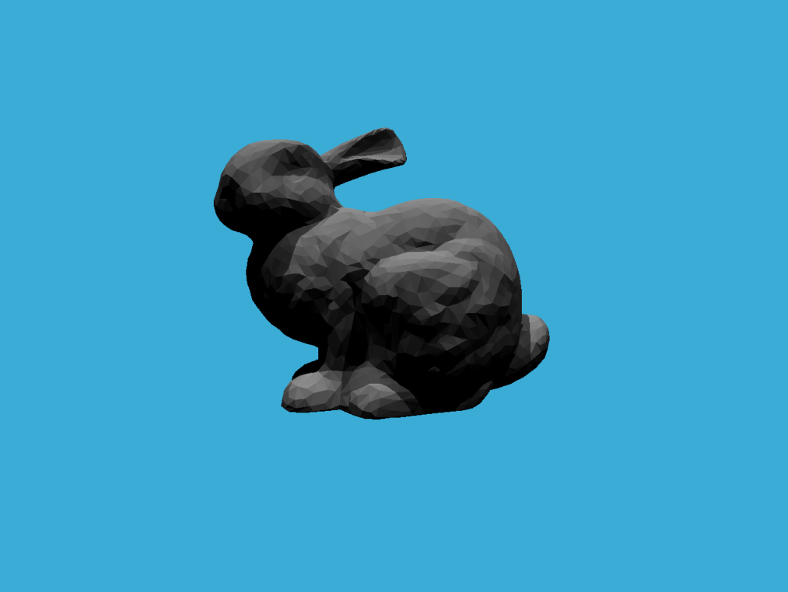

### 1.基础BVH

注意事项：

光线求交时，光线可能有两种方向，两种方向对于同一个boundingBox的min和max相反。

因此要判定沿坐标轴的光线方向正负。

### 2.SAH

实现后多次实验，发现针对此场景，SAH和BVH的速度差不多，有时SAH快一些，有时BVH快一些。(平均4500ms的情况下差值100~200ms)

在网上找大佬的实现方案本地实现并多次实验后，发现情况差不多，此场景SAH并不会稳定快于BVH。

(但大佬的方案代码更简洁，遍历次数更少)

针对此情况猜想：

SAH对于有大面积空间内很少的object与小面积空间内很多的object提效明显。

但此场景的兔子的triangles都紧紧的贴在一起，中间并没有很多大的空隙。可能SAH对于此场景提效就不太明显，和直接取中间值分割的算法效率差不多。

##### 参考链接：

https://medium.com/@bromanz/how-to-create-awesome-accelerators-the-surface-area-heuristic-e14b5dec6160

https://www.eccentricdevelopments.com/surface-area-heuristic/

https://www.cnblogs.com/dyccyber/p/18364065

