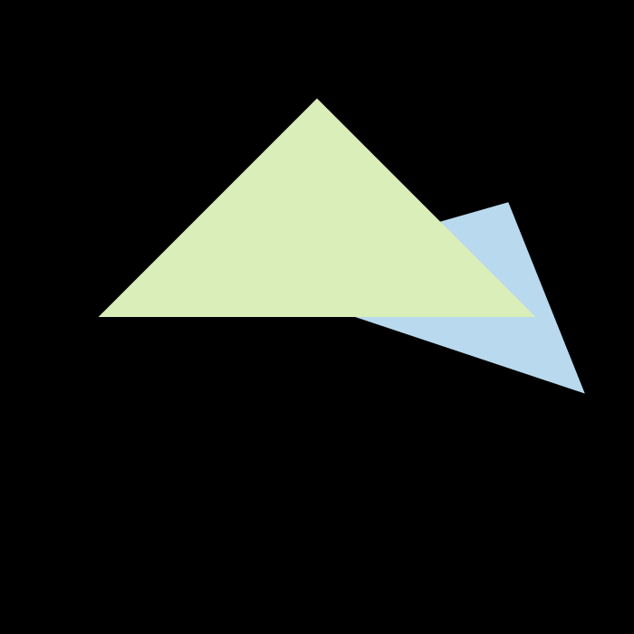

实现了自定义msaa?x(?只能为平方数)，对比不同采样点效果（0->4x效果明显，4x->16x效果没那么明显）

msaa4x效果：

msaa16x效果：

注意事项：

set_msaa_pixel内的机制需要思考一下。

一开始set_msaa_pixel时，frame_buf[ind] 直接+=color*covered_ratio。

这种写法在这个场景刚好没问题(先画的近的三角形，再画的远的三角形，z-buffer机制直接没画远的三角形)

但是如果把两个三角形换一个绘制顺序就会发现问题。

因此最后采用的像素颜色值：frame_buf[ind] = frame_buf[ind]*(1.0f-covered_ratio) + color *covered_ratio;